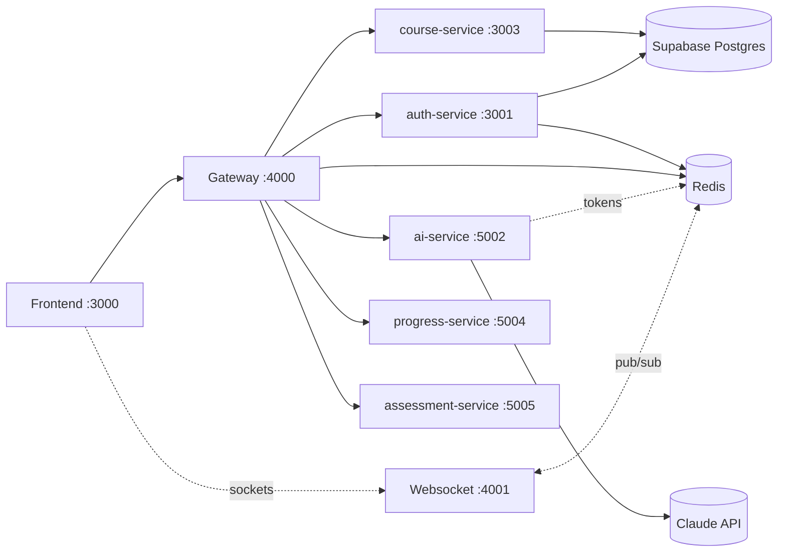
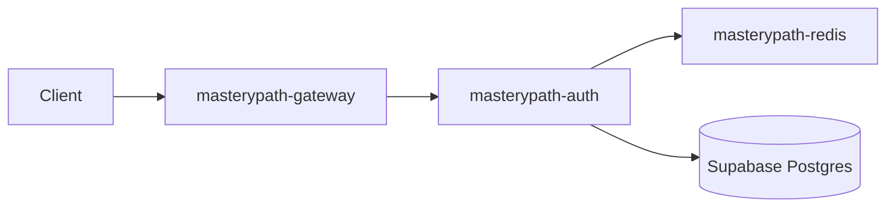

# AI Learning Platform

Monorepo for the AI-powered learning platform, built stage-by-stage per
[`masterypath-mvp-build-prompts.md`](masterypath-mvp-build-prompts.md). See
[`CLAUDE.md`](CLAUDE.md) for the project constitution (the actual architecture
this repo follows — it supersedes the build-kit's original pnpm/Vite plan).

## Structure

- **frontend/** — Next.js web app (separate ownership)
- **services/** — Backend microservices
- **packages/shared/** — Shared contracts, types, and utilities

## Local architecture



Only the frontend, gateway, and websocket service are meant to receive
outside traffic. The rest are internal — currently published on host ports
too, purely for local dev/testing convenience (`curl localhost:3003/health`
etc.), same as the existing auth/course services.

## Services

| Service | Port | Description | Status |
|--------|------|-------------|--------|
| auth  | 3001 | User authentication: sign up, sign in, forgot password, welcome email | Built |
| gateway | 4000 | API gateway (JWT verification, rate limiting, routing, health aggregation) | Built |
| course | 3003 | Course and lesson APIs | Built |
| ai | 5002 | Chat tutor streaming + course/quiz generation (Stage 3–5) | Skeleton (health only) |
| progress | 5004 | Dashboard, streaks, badges (Stage 6) | Skeleton (health only) |
| assessment | 5005 | Knowledge checks, module quizzes, grading (Stage 5) | Skeleton (health only) |
| websocket | 4001 | Socket.io + Redis adapter for AI token streaming (Stage 3) | Skeleton (health only, accepts connections) |

## Development

```bash
# Install dependencies (from repo root)
npm install

# Copy env template and fill in secrets (see Environment variables below)
cp .env.example .env

# Start Redis only (needed for npm run dev:auth / dev:gateway)
npm run dev:redis

# Run services locally
npm run dev:auth
npm run dev:gateway
npm run dev:course
npm run dev:ai
npm run dev:progress
npm run dev:assessment
npm run dev:websocket
```

## Environment variables

All services read from a single **`.env` at the repo root** (same folder as `docker-compose.yml`). Copy [`.env.example`](.env.example) and fill in values. Never commit `.env`.

**Minimum to run auth-service:** `DATABASE_URL`, `JWT_SECRET`, `REDIS_URL`.

### Redis in the stack

One `REDIS_URL` powers:

| Consumer | Use |
|----------|-----|
| **auth-service** | GET `/me` profile cache (15 min TTL), Google/GitHub OAuth state, **BullMQ email queue** |
| **gateway** | Free-tier chat rate limiting |

Auth-service **fails at startup** if `REDIS_URL` is missing.

### Redis by environment

| Environment | `REDIS_URL` | How |
|-------------|-------------|-----|
| **Docker Compose** | `redis://redis:6379` | Set automatically in [`docker-compose.yml`](docker-compose.yml); Redis container included |
| **Local `npm run dev:*`** | `redis://localhost:6379` | Run `npm run dev:redis` (starts Redis container) or install Redis locally |
| **Render (production)** | From Redis add-on | Create **Render Redis** or **Upstash** → copy connection URL → set `REDIS_URL` on the auth-service (and gateway when deployed) |

### Variable reference

| Variable | Service | Required | Default | Description |
|----------|---------|----------|---------|-------------|
| `JWT_SECRET` | auth, gateway, course | Yes (prod) | dev fallback in auth/course | Signs and verifies JWTs; must match across services |
| `DATABASE_URL` | auth, course | Yes | local Postgres URL | Supabase Session pooler URI recommended for Docker/Render |
| `COURSE_DATABASE_URL` | course | No | `DATABASE_URL` | Separate Postgres for course-service |
| `REDIS_URL` | auth, gateway | Yes (auth) | `redis://localhost:6379` (gateway) | Redis for profile cache, email queue, OAuth state, rate limits |
| `RESEND_API_KEY` | auth | No | — | Resend API key; without it emails log to console |
| `RESEND_FROM_ADDRESS` | auth | No | `onboarding@resend.dev` | Sender address (must be verified in Resend) |
| `RESET_LINK_BASE_URL` | auth | No | request Host | Base URL for password-reset links (use gateway URL in Docker) |
| `GOOGLE_CLIENT_ID` | auth | No | — | Google OAuth; disabled if empty |
| `GOOGLE_CLIENT_SECRET` | auth | No | — | Google OAuth secret |
| `GOOGLE_REDIRECT_URI` | auth | No | localhost callback | Google OAuth callback on auth-service |
| `GOOGLE_REDIRECT_FRONTEND_URL` | auth | No | `http://localhost:3000/auth/callback` | Where to send user after Google OAuth |
| `GITHUB_CLIENT_ID` | auth | No | — | GitHub OAuth; disabled if empty |
| `GITHUB_CLIENT_SECRET` | auth | No | — | GitHub OAuth secret |
| `GITHUB_REDIRECT_URI` | auth | No | localhost callback | GitHub OAuth callback on auth-service |
| `FRONTEND_URL` | gateway | No | `http://localhost:3000` | Frontend origin (reset-password redirect) |
| `FRONTEND_RESET_PASSWORD_PATH` | gateway | No | `/reset-password` | Path on frontend for reset form |
| `AUTH_SERVICE_URL` | gateway | No | `http://auth-service:3001` | Auth service upstream |
| `COURSE_SERVICE_URL` | gateway | No | `http://course-service:3003` | Course service upstream |
| `AI_SERVICE_URL` | gateway | No | `http://ai-service:5002` | AI service upstream |
| `PROGRESS_SERVICE_URL` | gateway | No | `http://progress-service:5004` | Progress service upstream |
| `ASSESSMENT_SERVICE_URL` | gateway | No | `http://assessment-service:5005` | Assessment service upstream |
| `WEBSOCKET_URL` | gateway | No | `http://websocket:4001` | Not proxied — used only by `/api/health` aggregation |
| `FREE_TIER_DAILY_LIMIT` | gateway | No | `5` | Daily chat requests for free tier |
| `SIGN_IN_MAX_ATTEMPTS` | gateway | No | `5` | Sign-in rate limit max attempts |
| `SIGN_IN_WINDOW_SECONDS` | gateway | No | `900` | Sign-in rate limit window (seconds) |
| `ANTHROPIC_API_KEY` | course, ai | Yes (AI features) | — | Claude API for course generation and chat tutor |
| `PORT` | each service | No | 3001 / 4000 / 3003 / 5002 / 5004 / 5005 / 4001 | HTTP listen port |

### Secret management (production)

For v1, **platform environment variables** are your secret manager (no GCP/AWS SDK required):

**Render (auth-service):**

1. Render Dashboard → your service → **Environment**
2. Add: `DATABASE_URL`, `JWT_SECRET`, `REDIS_URL`, `RESEND_API_KEY`, OAuth secrets, etc.
3. Create a **Redis** add-on (or Upstash) and paste its URL as `REDIS_URL`
4. Redeploy after changing env vars

**Railway** (gateway/course if deployed there): Project → service → **Variables** tab — same variable names.

**GitHub Actions** deploy secrets are separate — see [CI/CD](#cicd-github-actions) below. Do not put production secrets in the repo.

### Database (Supabase)

1. Supabase Dashboard → your project → **Connect** → **Session** tab.
2. Copy the pooler connection string (URI).
3. Paste as `DATABASE_URL=` in `.env` (no quotes). If the password contains `@`, use `%40`.

If you use the direct URI (`db....supabase.co`) or the wrong region, you may see `ENETUNREACH` or "Tenant or user not found".

## Running with Docker

```bash
cp .env.example .env
# Edit .env: set DATABASE_URL (Supabase Session pooler), JWT_SECRET, etc.
docker compose up -d
```

Docker Compose starts **Redis** automatically and sets `REDIS_URL=redis://redis:6379` on auth-service and gateway.

## Deploy to Render (Phase 1)

Phase 1 deploys **Redis + auth-service + gateway**. Course and AI tutor are Phase 2/3 (commented in [`render.yaml`](render.yaml)).



### Before you deploy

1. Push this repo to GitHub.
2. Have ready (do not commit): `DATABASE_URL` (Supabase Session pooler), `JWT_SECRET`, `RESEND_API_KEY`, OAuth secrets.
3. If your GitHub repo root is `mastery_path/`, set Render **Root Directory** → `ai-learning-platform`.

### Step 1 — Run auth migrations

```bash
cd ai-learning-platform
npm install
npm run migrate:auth
```

Verify in Supabase: `pgmigrations` table exists.

### Step 2 — Create services from Blueprint

1. [dashboard.render.com](https://dashboard.render.com) → **New** → **Blueprint**.
2. Connect GitHub and select the repo (set Root Directory if needed).
3. Render reads [`render.yaml`](render.yaml) → **Apply** (creates Redis, auth, gateway).

### Step 3 — Set secrets in Render Dashboard

**masterypath-auth** (`sync: false` vars):

| Variable | Value |
|----------|--------|
| `DATABASE_URL` | Supabase Session pooler URI |
| `JWT_SECRET` | Same on auth and gateway |
| `RESEND_API_KEY` | Resend API key |
| `RESEND_FROM_ADDRESS` | Verified sender |
| `GOOGLE_REDIRECT_URI` | `https://<gateway-host>/api/auth/google/callback` |
| `GOOGLE_REDIRECT_FRONTEND_URL` | Frontend OAuth callback URL |
| `GITHUB_REDIRECT_URI` | `https://<gateway-host>/api/auth/github/callback` |

`REDIS_URL` and `RESET_LINK_BASE_URL` are wired automatically by the blueprint.

**masterypath-gateway**:

| Variable | Value |
|----------|--------|
| `JWT_SECRET` | Must match auth exactly |
| `FRONTEND_URL` | Frontend origin (e.g. Vercel URL) |

`AUTH_SERVICE_URL` and `REDIS_URL` are wired automatically.

Save → **Manual Deploy** on auth, then gateway.

### Step 4 — OAuth redirect URIs

In Google Cloud Console / GitHub OAuth app, register:

- `https://<gateway-host>/api/auth/google/callback`
- `https://<gateway-host>/api/auth/github/callback`

Use the **gateway** URL, not auth directly.

### Step 5 — Verify

```bash
curl https://<gateway-host>/health
# → {"status":"ok","service":"gateway"}

curl -X POST https://<gateway-host>/api/auth/sign-up \
  -H "Content-Type: application/json" \
  -d '{"email":"test@example.com","password":"SecurePass123!","name":"Test User"}'
```

Auth logs should show `Email queue ready (BullMQ)`.

Postman: import [`services/auth-service/postman/AI-Learning-Platform-Auth-API.postman_collection.json`](services/auth-service/postman/AI-Learning-Platform-Auth-API.postman_collection.json), set `baseUrl` to your gateway URL.

### Free tier notes

- Web services spin down after ~15 min idle; first request may take 30–60s.
- Upgrade to Starter for always-on production demos.

### Phase 2 / 3 (later)

Uncomment course and ai blocks in [`render.yaml`](render.yaml), add gateway env vars (`COURSE_SERVICE_URL`, `AI_SERVICE_URL`), set `ANTHROPIC_API_KEY`, redeploy.

### Troubleshooting

| Symptom | Fix |
|---------|-----|
| Auth crashes on start | Check Redis add-on; `REDIS_URL` must be set |
| `Tenant or user not found` | Re-copy Supabase **Session** pooler URI |
| Gateway 503 on `/api/auth/*` | Auth not deployed or `AUTH_SERVICE_URL` wrong |
| OAuth redirect mismatch | Use gateway `/api/auth/.../callback` URLs |
| JWT errors | `JWT_SECRET` must match on auth and gateway |

## CI/CD (GitHub Actions)

### Workflow

| Workflow | Trigger | Purpose |
|----------|---------|---------|
| [`.github/workflows/ci.yml`](.github/workflows/ci.yml) | PR → `dev` or `main` | Lint, typecheck, tests (path-filtered) |
| [`.github/workflows/deploy.yml`](.github/workflows/deploy.yml) | Push → `main` | Deploy to Railway / Vercel |

**Branch flow:** Open PRs into `dev` → merge when `ci-gate` passes → merge `dev` into `main` yourself → push to `main` deploys.

### Local CI commands

```bash
npm run lint:services
npm run test:services
npm run lint -w @ai-learning-platform/frontend
npm run typecheck -w @ai-learning-platform/frontend
```

After changing dependencies, run `npm install` at the repo root and commit `package-lock.json`.

### Branch protection

**Settings → Branches → Add rule**

**`dev` and `main`:**

- Require a pull request before merging
- Require status checks to pass → select **`ci-gate`** (appears after the first PR workflow run)
- Require branches to be up to date before merging (recommended)
- Do not allow bypassing the above settings

Only **`ci-gate`** is required (not the individual lint/test jobs), so path-filtered skips do not block merges.

### GitHub Actions secrets

| Secret | Required for | Where to get it |
|--------|----------------|-----------------|
| `RAILWAY_TOKEN` | Backend (+ optional frontend) deploy | Railway → Account Settings → Tokens |
| `RAILWAY_SERVICE_ID_AUTH` | auth-service deploy | Railway service → Settings → Service ID |
| `RAILWAY_SERVICE_ID_GATEWAY` | gateway deploy | Same |
| `RAILWAY_SERVICE_ID_COURSE` | course-service deploy | Same |
| `RAILWAY_FRONTEND_SERVICE_ID` | Frontend on Railway (if not using Vercel) | Same |
| `VERCEL_TOKEN` | Frontend on Vercel (preferred when set) | Vercel → Settings → Tokens |
| `VERCEL_ORG_ID` | Vercel deploy | Project settings or `.vercel/project.json` |
| `VERCEL_PROJECT_ID` | Vercel deploy | Same |

**CI needs no secrets.**

Frontend deploy: if `VERCEL_TOKEN` is set, Vercel is used; otherwise Railway when `RAILWAY_FRONTEND_SERVICE_ID` is set.

Configure each Railway service with Dockerfile `services/<name>/Dockerfile` and build context = repo root.

## Architecture

- **Microservices**: Each service is a bounded context with its own data and APIs.
- **Clean Architecture**: Services follow domain → application → infrastructure → interfaces.
- **Contracts**: APIs and events are defined in `packages/shared`; services depend on contracts, not implementations.
